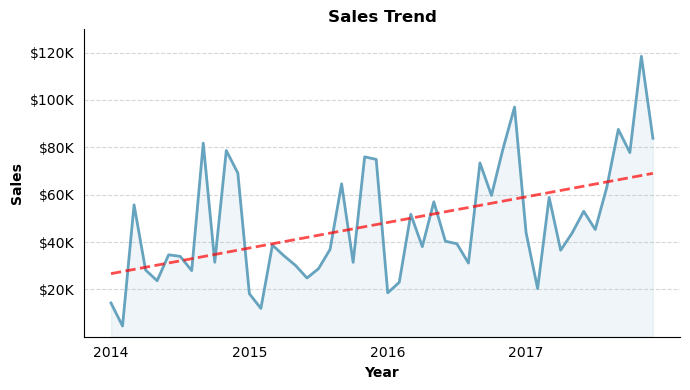
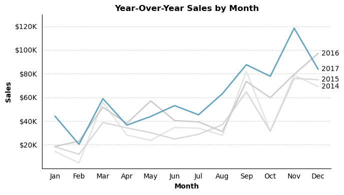
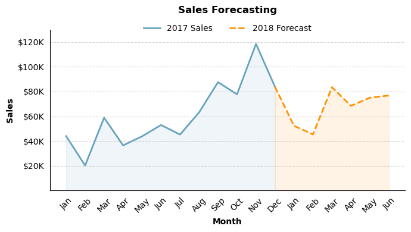
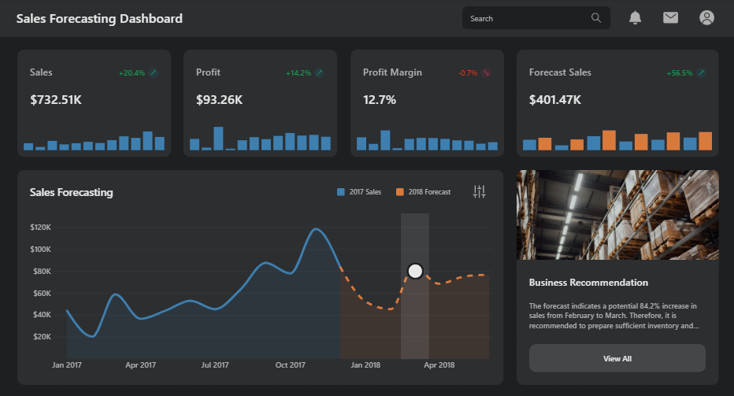

# Sales Forecasting Menggunakan Metode Holt-Winters

# Ringkasan

Dengan menggunakan data [Superstore](https://www.kaggle.com/datasets/vivek468/superstore-dataset-final), dilakukan pembuatan model sales forecasting menggunakan metode Holt-Winters. Metode ini dipilih karena mampu menangkap tren penjualan serta pola musiman yang terdapat dalam data. Analisis mencakup identifikasi tren jangka panjang, pola musiman, hingga proyeksi penjualan 6 bulan ke depan beserta rekomendasi bisnis yang menyertainya.

# Pertanyaan Bisnis

1. Bagaimana tren penjualan dalam beberapa tahun terakhir?
2. Apakah terdapat pola musiman yang mempengaruhi penjualan setiap bulannya?
3. Bagaimana proyeksi penjualan 6 bulan ke depan, dan langkah apa yang perlu disiapkan untuk menghadapinya?

# Tools yang Digunakan

## 1. PostgreSQL

Digunakan untuk menulis query dalam proses persiapan data.

## 2. Python

Digunakan sebagai tools utama dalam proses analisis. Library yang digunakan pada project ini antara lain:

- Pandas: Untuk manipulasi dan pengolahan data.
- Numpy: Untuk membuat array.
- Matplotlib: Sebagai dasar visualisasi data.
- Seaborn: Untuk membuat visualisasi statistik.
- Statsmodels: Untuk membangun model forecasting menggunakan metode Holt-Winters.

## 3. Power BI

Digunakan untuk menyajikan hasil analisis dalam bentuk dashboard.

# Persiapan Data

Persiapan data meliputi standarisasi format tanggal pada kolom `order_date`, mengekstrak informasi bulan dan tahun dari kolom `order_date`, serta melakukan agregasi untuk mendapatkan total sales dan profit tiap bulan.

Detail proses persiapan dan agregasi data dapat dilihat pada file berikut: [Data_Preparation](SQL/Data_Preparation.sql)

### Agregasi Data

<details>
<summary>Lihat query</summary>

```sql
SELECT
    CAST(CONCAT_WS('-', order_year, month_number, 1) AS DATE) AS order_date,
    order_year,
    order_month,
    month_number,
    SUM(sales) AS sales,
    SUM(profit) AS profit,
    'Actual' AS data_type
FROM monthly_sales
GROUP BY
    order_year, order_month, month_number
ORDER BY
    order_year, month_number;
```

</details>

# Proses Analisis

## Tren Penjualan

Proses diawali dengan memuat data hasil agregasi dari PostgreSQL. Data kemudian divisualisasikan dalam bentuk line chart untuk mengidentifikasi tren penjualan jangka panjang.

Detail proses analisis dapat dilihat pada notebook berikut: [1_Sales_Trend](Python/1_Sales_Trend.ipynb)

### Visualisasi Data

<details>
<summary>Lihat kode visualisasi</summary>

```python
plt.figure(figsize=(7,4))
sns.lineplot(x=range(len(df)), y=df['sales'], ls='-', lw=2, color='#66A3BF', alpha=1)
plt.fill_between(x=np.array(range(len(df))), y1=df['sales'], color='#66A3BF', alpha=0.1)
sns.regplot(x=np.array(range(len(df))), y=df['sales'], scatter=False, ci=None,
            line_kws={'ls':'--', 'lw':2, 'color':'red', 'alpha':0.7})

title_dict = {'family':plt.rcParams['font.family'],
              'size':12,
              'weight':'bold',
              'color':'black',
              'loc':'center',
              'rotation':0,
              'pad':5,
              'alpha':1}

label_dict = {'x':
              {'family':plt.rcParams['font.family'],
              'size':10,
              'weight':'bold',
              'color':'black',
              'loc':'center',
              'rotation':0,
              'alpha':1}, 
              
              'y':
              {'family':plt.rcParams['font.family'],
              'size':10,
              'weight':'bold',
              'color':'black',
              'loc':'center',
              'rotation':90,
              'alpha':1}}

plt.title('Sales Trend', **title_dict)
plt.xlabel('Year', **label_dict['x'])
plt.ylabel('Sales', **label_dict['y'])

ax = plt.gca()
ax.tick_params(which='major', axis='both', left=False, bottom=False)
ax.set_xticks(ticks=range(0, len(df), 12), labels=df['order_year'].unique())
ax.set_yticks(ticks=ax.get_yticks()[2:-1])
ax.yaxis.set_major_formatter(plt.FuncFormatter(lambda y, pos: f'${y/1_000:.0f}K'))
ax.set_ylim(0, 130_000)

plt.grid(which='major', axis='y', ls='--', alpha=0.5)
plt.tight_layout()
sns.despine(left=False, top=True, right=True, bottom=False)
plt.show()
```

<\details>

### Hasil



## Pola Musiman

Proses diawali dengan memuat data hasil agregasi dari PostgreSQL. Data kemudian divisualisasikan dalam bentuk line chart untuk mengidentifikasi pola musiman antar tahun.

Detail proses analisis dapat dilihat pada notebook berikut: [2_YoY_Sales_by_Month](Python/2_YoY_Sales_by_Month.ipynb)

### Visualisasi Data

<details>
<summary>Lihat kode visualisasi</summary>

```python
plt.figure(figsize=(7,4))
palette = ['#e5e5e5', '#d9d9d9', '#cdcdcd', '#66A3BF']
sns.lineplot(data=df, x='order_month', y='sales', hue='order_year', ls='-', lw=2, palette=palette, alpha=1)

title_dict = {'family':plt.rcParams['font.family'],
              'size':12,
              'weight':'bold',
              'color':'black',
              'loc':'center',
              'rotation':0,
              'pad':5,
              'alpha':1}

label_dict = {'x':
              {'family':plt.rcParams['font.family'],
              'size':10,
              'weight':'bold',
              'color':'black',
              'loc':'center',
              'rotation':0,
              'alpha':1}, 
              
              'y':
              {'family':plt.rcParams['font.family'],
              'size':10,
              'weight':'bold',
              'color':'black',
              'loc':'center',
              'rotation':90,
              'alpha':1}}

plt.title('Year-Over-Year Sales by Month', **title_dict)
plt.xlabel('Month', **label_dict['x'])
plt.ylabel('Sales', **label_dict['y'])

ax = plt.gca()
ax.tick_params(which='major', axis='both', left=False, bottom=False)
ax.set_xticks(ticks=ax.get_xticks(), labels=df['order_month'].map(lambda x: x[:3]).unique())
ax.set_yticks(ticks=ax.get_yticks()[2:-1])
ax.yaxis.set_major_formatter(plt.FuncFormatter(lambda y, pos: f'${y/1_000:.0f}K'))
ax.set_ylim(0, 130_000)

x = ax.get_xticks().max() + 0.15
y = df.loc[df['order_month'] == 'December', 'sales'].values
s = df['order_year'].astype(str).unique()

for i in range(len(s)):
    plt.text(x=x, y=y[i], s=s[i], size=10, weight='normal', color='black', ha='left', va='center')

plt.legend().set_visible(False)
plt.grid(which='major', axis='y', ls='--', alpha=0.5)
plt.tight_layout()
sns.despine(left=False, top=True, right=True, bottom=False)
plt.show()
```

<\details>

### Hasil



## Membangun Model Forecasting

Proses diawali dengan memuat data hasil agregasi dari PostgreSQL. Data kemudian digunakan untuk membangun model forecasting guna memprediksi penjualan 6 bulan ke depan. Hasil forecast selanjutnya divisualisasikan dalam bentuk line chart untuk melihat kelanjutan pola penjualan.

Detail proses analisis dapat dilihat pada notebook berikut: [3_Sales_Forecasting](Python/3_Sales_Forecasting.ipynb)

### Visualisasi Data

<details>
<summary>Lihat kode visualisasi</summary>

```python
df_2017 = df[df['order_year'] == 2017].copy()
sales = df_2017['sales'].values
sales_forecast = np.array([df['sales'].values[-1]] + forecast.tolist())

plt.figure(figsize=(7,4))
sns.lineplot(x=np.array(range(len(sales))), y=sales, ls='-', lw=2, color='#66A3BF', zorder=1, label='2017 Sales')
plt.fill_between(x=np.array(range(len(sales))), y1=sales, color='#66A3BF', alpha=0.1)
sns.lineplot(x=np.array(range(11, 18)), y=sales_forecast, ls='--', lw=2, color='#FF9100', zorder=2, label='2018 Forecast')
plt.fill_between(x=np.array(range(11, 18)), y1=sales_forecast, color='#FF9100', alpha=0.1)

title_dict = {'family':plt.rcParams['font.family'],
              'size':12,
              'weight':'bold',
              'color':'black',
              'loc':'center',
              'rotation':0,
              'pad':20,
              'alpha':1}

label_dict = {'x':
              {'family':plt.rcParams['font.family'],
              'size':10,
              'weight':'bold',
              'color':'black',
              'loc':'center',
              'rotation':0,
              'alpha':1}, 
              
              'y':
              {'family':plt.rcParams['font.family'],
              'size':10,
              'weight':'bold',
              'color':'black',
              'loc':'center',
              'rotation':90,
              'alpha':1}}

plt.title('Sales Forecasting', **title_dict)
plt.xlabel('Month', **label_dict['x'])
plt.ylabel('Sales', **label_dict['y'])

ax = plt.gca()
ax.tick_params(which='major', axis='both', left=False, bottom=False)
months = df_2017['order_month'].map(lambda x: x[:3]).values.tolist()
months += months[:6]
ax.set_xticks(ticks=list(range(18)), labels=months, rotation=45)
ax.set_yticks(ticks=ax.get_yticks()[2:-1])
ax.yaxis.set_major_formatter(plt.FuncFormatter(lambda y, pos: f'${y/1_000:.0f}K'))
ax.set_ylim(0, 130_000)

plt.legend(loc='upper center', frameon=False, bbox_to_anchor=(0.5, 1.08), ncol=2, prop={'size':10, 'weight':'normal'})
plt.grid(which='major', axis='y', ls='--', alpha=0.5)
plt.tight_layout()
sns.despine(left=False, top=True, right=True, bottom=False)
plt.show()
```

<\details>

### Hasil



# Dashboard Overview

Bagian ini menampilkan dashboard interaktif yang dibuat menggunakan Power BI untuk menyajikan hasil analisis.

File dashboard dapat dilihat di sini: [Sales_Forecasting_Dashboard](Power_BI/Sales_Forecasting_Dashboard.pbix)

### Tampilan Dashboard



**Note**: Aset visual yang digunakan dalam dashboard ini bersumber dari [Magnific](https://www.magnific.com/app) dan [Unsplash](https://unsplash.com/id).

# Business Recommendation

Hasil forecast menunjukkan total penjualan diproyeksikan mencapai $401K, atau meningkat sebesar 56.5% dibandingkan periode yang sama pada tahun sebelumnya. Selain itu, penjualan diprediksi meningkat sebesar 84.2% dari Februari ke Maret. Oleh karena itu, disarankan untuk mempersiapkan persediaan barang serta memaksimalkan promosi sejak Februari guna mengantisipasi lonjakan penjualan di bulan Maret.